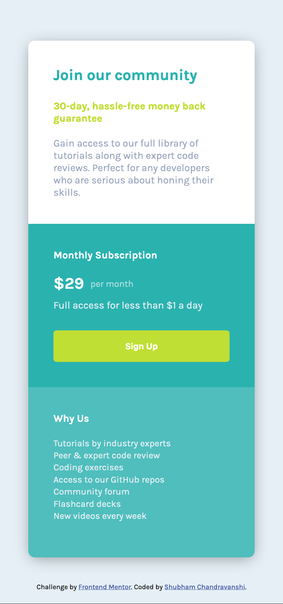
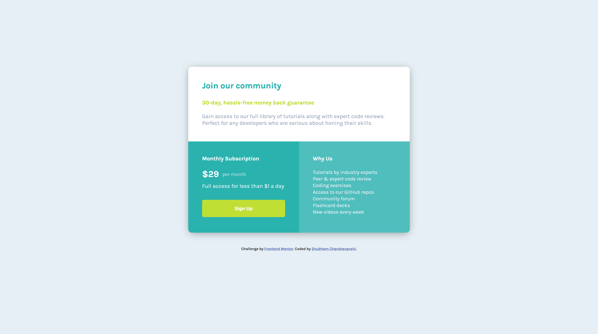

# Frontend Mentor - Single price grid component solution

This is a solution to the [Single price grid component challenge on Frontend Mentor](https://www.frontendmentor.io/challenges/single-price-grid-component-5ce41129d0ff452fec5abbbc). Frontend Mentor challenges help you improve your coding skills by building realistic projects. 

## Table of contents

- [Overview](#overview)
  - [The challenge](#the-challenge)
  - [Screenshot](#screenshot)
  - [Links](#links)
- [My process](#my-process)
  - [Built with](#built-with)
  - [What I learned](#what-i-learned)
  - [Continued development](#continued-development)
  - [Useful resources](#useful-resources)
- [Author](#author)
- [Acknowledgments](#acknowledgments)

## Overview

### The challenge

Users should be able to:

- View the optimal layout for the component depending on their device's screen size
- See a hover state on desktop for the Sign Up call-to-action

### Screenshot

Mobile View
<br>

Desktop View


### Links

- Live Site URL: [Site deployed on GitHub Page](https://shubhamcweb.github.io/price-grid-frontend-component/)

## My process

### Built with

- Semantic HTML5 markup
- CSS custom properties
- Google Fonts

### What I learned

This was my 2nd Frontend Mentor challenge that I completed and it helped me really understand the HTML/CSS frontend workflow. I learned how to use structured and semantic HTML elements and further increased my understanding of CSS layouts and styling.

As of writing this README, I've not yet gotten into learning Grids and Flexbox in CSS, so laying out two divs side by side was quite interesting using CSS's "inline-block" display property. I also learnt that this property doesn't work if the elements are not in-line in the HTML document itself, that is to say that they have some whitespacing or new-line character in between.

I got around that quirk in two ways:
1. By simply putting shorter div elements physically in-line
```html
<div id="price">$29</div><div id="price-frequency">per month</div>
```
2. By putting a multiline comment in the whitespacing between larger divs to maintain readability
```html
    <div id="bottom-left">
      .....
    </div><!-- There cannot be any whitespace or new line character between inline-block elements
  --><div id="bottom-right">
      .....
    </div>
```
 
I also learnt that sometimes in-line block elements need their "vertical-align" property to be set otherwise they start behaving in an undesirable manner.
```css
#bottom-left, #bottom-right {
  display: inline-block;
  vertical-align: top;
}
```

Overall, this challenge really helped me learn different concepts and usage of semantic HTML and CSS styling and I see myself ahead from where I was before. I hope to do many more challenges next, and keep learning and growing further!

### Continued development

After completing this project I feel I have a basic understanding of HTML and CSS and now my next goal will be to learn CSS Flexbox and Grid layouts and other CSS frameworks.

Also, I will further focus on my skills to implement responsive mobile-friendly websites and then hopefully move on to other challenges that will give me the opportunity to apply my knowledge in a more hands-on manner.

### Useful resources

- [HTML Color Converter](https://htmlcolors.com/color-converter) - A really useful tool to convert different color values from (and to) different formats like RGB, HEX, HSL, etc.
- [Box Shadow CSS Generator](https://www.example.com) - An amazing tool that lets you visually experiment with different box-shadow parameters and outputs the CSS to implement that.

## Author

I am Shubham Chandravanshi, the author of this GitHub repo. I am a computer science major at The University of Texas at Arlington and am an eager learner.

I am very passionate in web development, and currently learning new technologies in the field of both frontend and backend web development, and am interested and looking for remote/on-site internships in the United States of America.

- LinkedIn - [Shubham Chandravanshi](https://www.linkedin.com/in/shubhamcweb)

## Acknowledgments

I would like to give speacial thanks to @zachgoll (Zach Gollwitzer), for his incredible free crashcourse video "Frontend Web Development Bootcamp Course (JavaScript, HTML, CSS)" on freeCodeCamp.org channel on YouTube, who led me to this challenge. A fantastic teacher in every way!

Here are some links if you want to see his work:
- Website - [zachgollwitzer.com](https://zachgollwitzer.com)
- Twitter - [@zg_dev](https://twitter.com/zg_dev)
- YouTube - [@zachgoll](https://www.youtube.com/@zachgoll/about)
- The above mentioned video - [Frontend Bootcamp](https://www.youtube.com/watch?v=zJSY8tbf_ys&t=58873s)